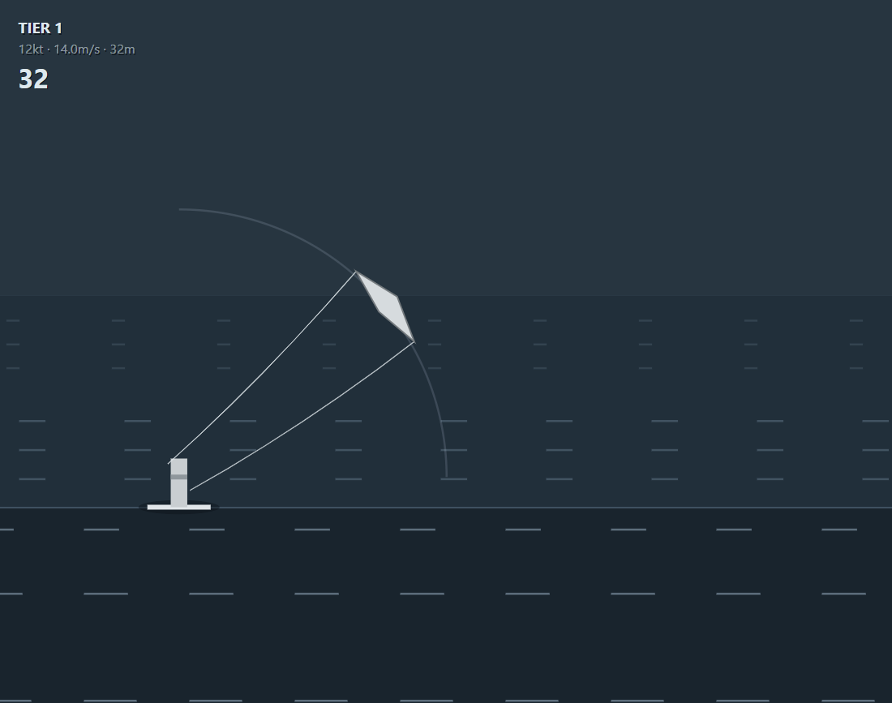
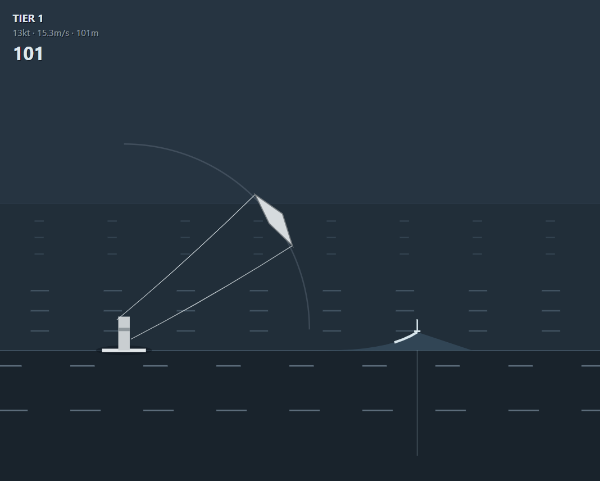
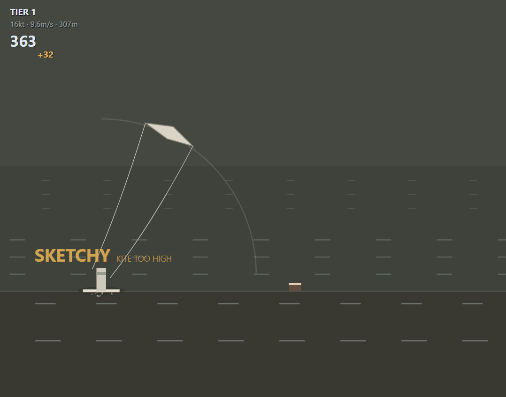
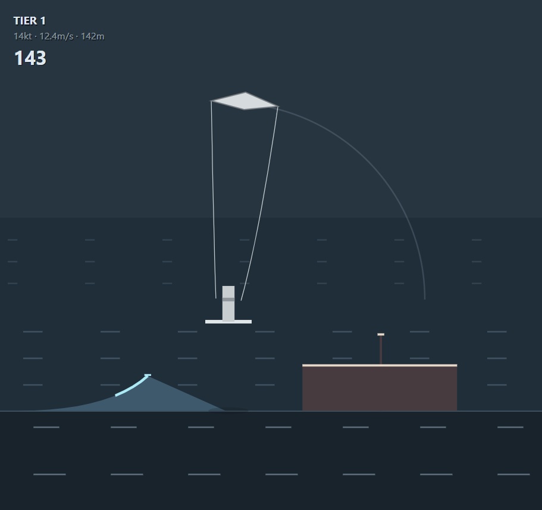

# How to play Kitesurf

You ride an endless ocean, left or right. Wind rises the further you go. Waves are the
only way to get real height; boats, buoys and piers are the only way to die. Botched
tricks cost tempo, never the run.

> **A kite low in the window gives you power and speed. A kite at the zenith gives you
> lift but no drive. You cannot have both at once.**

The kite hangs on an arc from straight overhead (**zenith**, 0°) to straight ahead of you
(**the edge**, 90°). You point at an angle and it flies there at its own rate — about a
second end to end in light wind.



## Controls

| Desktop | |
|---|---|
| Move the mouse | Points the kite. Only the *angle* from you to the cursor counts, not the distance. |
| Hold left click or Space | Load the edge. Release to pop. |
| ← → or A D | Pick a direction, at the start or after a crash. |
| Any key or click | Ride again. |

| Mobile — landscape, two thumbs | |
|---|---|
| Left thumb, on the kite arc | Points the kite. Roughly the right direction is enough; you don't have to trace the line. |
| Right thumb, front third | Loads the edge anywhere in that third. Lift to pop. |
| Tap a side | Chooses that direction; after a crash, any tap goes again. |

## The jump, in five beats

1. **Build speed.** Fly the kite near 70°, where forward pull peaks. Top speed is 22 m/s.
2. **Load the edge.** Hold the input and carve. Tension builds in proportion to your
   speed: ~0.7s to full at top speed, never at a standstill.
3. **Don't hold too long.** Once full you have 0.4s of grace; past it the edge catches and
   costs you 40% of your speed *and* the pop it was building.
4. **Send it.** The pop is your load times the kite's *lift*, so the kite has to be sweeping
   up to the zenith as you release — which is exactly where it makes no speed. That is the
   whole trade.
5. **Steer the air, then land.** Kite high stretches the hangtime and bleeds speed; kite
   low drives you forward and cuts the air short. Bring it back into the band before you
   touch down.

## Waves

Flat water is capped around 5m of air however well you play it. Every big jump comes off a
wave.

| Kicker | Ramp | Perfect bonus | |
|---|---|---|---|
| **Chop** | 0.3m | 1.15× | Barely any height, but it counts as a trick — combo food. |
| **Wave** | 1.0m | 1.60× | The bread-and-butter kicker. |
| **Boat wake** | 1.8m | 2.40× | The biggest air in the game, attached to a lethal boat. |

Release at the **lip** — the top of the face, marked by a foam post and a guide dropped in
the water ahead of you. Within ~±0.12s you keep about 85% of the bonus; miss by 0.30s and
you get nothing. Waves are telegraphed ~2.5s out by a chevron at the edge of the screen.
The face kicks you up on its own, but only if you had load to spend.



## Landings

Graded on where the kite is and how fast you are coming down. The descent is judged against
the height you reached, so a big air is never automatically a bad landing.

| Verdict | Kite | What it costs |
|---|---|---|
| **CLEAN** | 35°–75°, soft descent | Nothing. Combo **+1**. |
| **SKETCHY** | 20°–85°, hard descent | 25% of your speed, combo **−1**. Scores at 40%. |
| **WIPEOUT** | outside that | All speed, combo back to 1×, no score. |

A sketchy landing names what you missed: **KITE TOO HIGH**, **KITE TOO LOW** or **DOWN TOO
FAST**. After a wipeout the kite is in the water — **steer it back out to the edge** to
relaunch, about 2s if you react at once.



## What kills you

| | Size | |
|---|---|---|
| **Buoy** | 0.5m | Easy to hop, punishes pure cruising. |
| **Boat** | 2.4m hull, 4m mast | The wake sits 8m ahead of the stern — that wake is how you clear the boat. |
| **Pier** | 3m wall | Rare, tier 3+. Forces a committed send. |

Nothing is ever unavoidable: every obstacle is placed far enough out that a rider reacting
in half a second can still get to speed, build an edge, sweep the kite and clear it. They
crowd closer as the wind rises — 110–320m apart in tier 1, 64–89m in tier 4.




## Wind tiers

Wind scales with distance, not time, so riding slowly buys you nothing.

| Tier | From | Wind | Multiplier |
|---|---|---|---|
| 1 | 0m | 12kt | 1.0× |
| 2 | 500m | 18kt | 1.5× |
| 3 | 1500m | 25kt | 2.5× |
| 4 | 3000m | 35kt+ | 4.0× |

## Scoring

```
jump  = apex^1.5 × 10 × landing quality × combo × clearance × tier
total = every jump added up + 1 point per metre
```

Height is superlinear — one huge send beats two safe ones.

- **Combo, to 10×.** Clean landing off a wave +1, sketchy −1, wipeout back to 1×. A
  flat-water hop is not a trick and moves it neither way. It decays one rung per 150m
  without a landed trick.
- **Clearance, to 1.5×.** Pass within 0.75m of the top of an obstacle. Flying safely over
  the same boat scores nothing extra — that is the greedy line.

Your score, best jump and distance are kept per browser. The distance PB stands in the
water as a pole; the jump PB is the dashed line in the sky.

## Getting better

- **Speed first.** A slow approach loads slowly, pops weakly and lands badly.
- **Start the sweep early.** Begin the send at the lip and you release with the kite
  halfway up, for nothing.
- **Let go before the stall.** Two fast, well-timed pops beat one greedy one.
- **Come down with the kite in the band.** Most early wipeouts are KITE TOO HIGH.
- **Chase boats.** The highest launch and the best clearance bonus sit 8m apart.

---

`?debug=1` in the URL opens a live physics readout and a wind slider.
